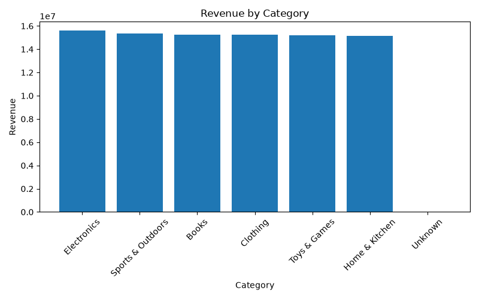
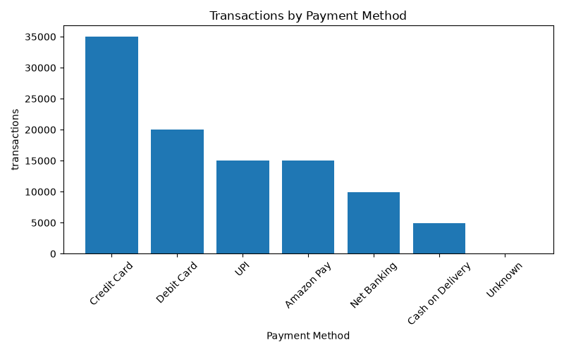

# ETL Pipeline Project

## Overview

This project demonstrates an end-to-end ETL (Extract, Transform, Load) pipeline using Python, Pandas, SQLite, SQL, and Matplotlib.

The pipeline processes raw sales data, handles missing values, standardizes data formats, loads data into a database, and generates business insights through SQL queries and dashboards.

---

## Tech Stack

- Python
- Pandas
- SQLite
- SQL
- Matplotlib
- VS Code

---

## Project Structure

```
etl-pipeline-folder/
│
├── data/
│   ├── sales_data.csv
│   ├── imputed_sales_data.csv
│   ├── standardised_sales_data.csv
│
├── scripts/
│   ├── extract.py
│   ├── impute.py
│   ├── standardise.py
│   ├── load.py
│   ├── dashboard.py
│
├── dashboard/
│   ├── revenue_by_payment_method.png
│   ├── revenue_by_category.png
│   ├── transactions_by_payment_method.png
│
├── sales.db
└── README.md
```

---

## ETL Workflow

### Extract

- Read raw sales data from CSV
- Inspect dataset structure

### Transform

- Handle missing values
- Standardize data formats
- Perform data cleaning

### Load

- Load cleaned data into SQLite database

---

## SQL Analysis

Examples of business questions answered:

- Total Revenue
- Revenue by Category
- Revenue by Payment Method
- Number of Transactions
- Average Order Value
- Highest Value Orders

---

## Dashboards

Generated visualizations include:

1. Revenue by Payment Method
2. Revenue by Category
3. Transactions by Payment Method

---

## Key Learnings

- Data Cleaning
- Missing Value Imputation
- Data Standardization
- SQL Aggregations
- SQLite Database Operations
- Dashboard Creation
- ETL Pipeline Design

## Dashboard Screenshots
### Revenue by payment method


### Revenue by Category


### Transactions by Payment Method

